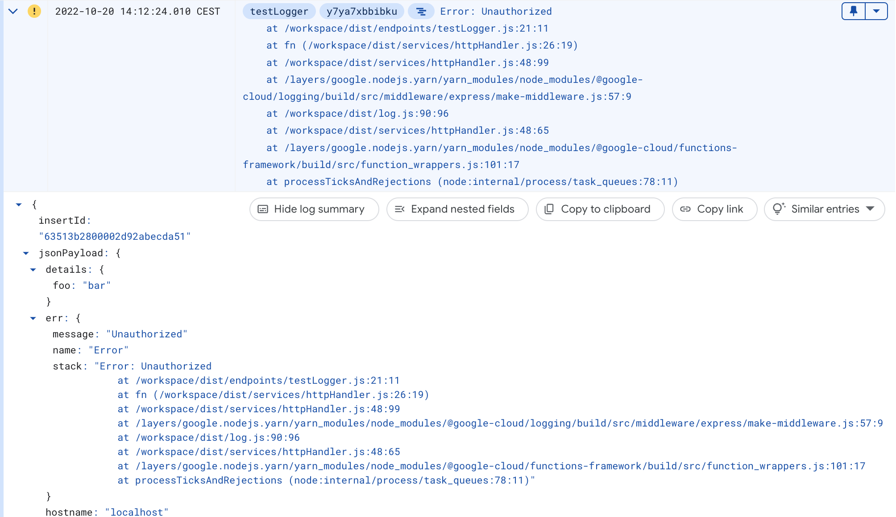
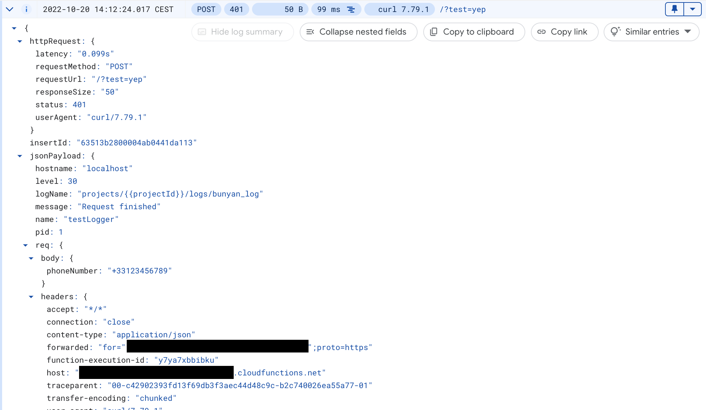
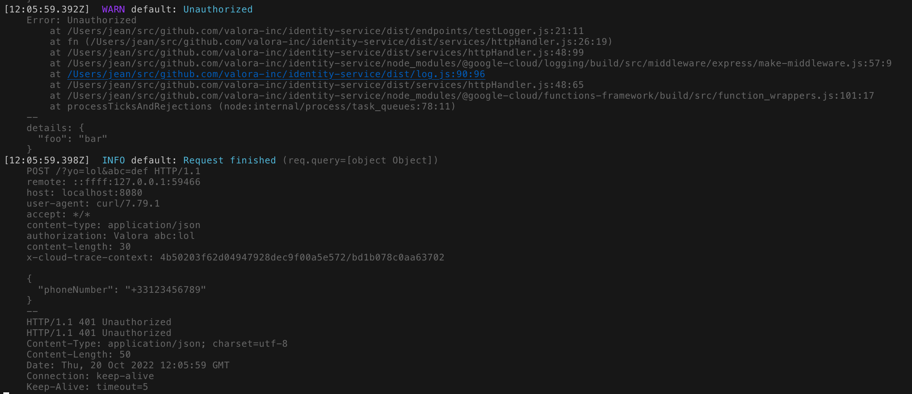

# @valora/log

Thin wrapper for bunyan structured logs on Google Cloud and local development, with sensitive data redaction.

## Installing the library

```
yarn add @valora/log
```

## Using the library

### Simple usage

```typescript
import { createLogger } from '@valora/log'

const logger = createLogger({
  level: 'info', // Optional, defaults to 'info'
})

logger.info({ foo: bar }, 'Hello world!')
logger.warn(err, 'A non fatal error')
logger.warn({ err, foo: bar }, 'A non fatal error')
logger.error(err, 'Something went wrong')
logger.error({ err, foo: bar }, 'Something went wrong')
```

### Redacting sensitive data

#### Redacting specific fields

```typescript
import { createLogger } from '@valora/log'

const logger = createLogger({
  redact: {
    paths: [
      'req.headers.authorization',
      'req.headers.cookie',
      'req.body.token',
      '*.password',
    ],
  },
})

// The authorization header and the other fields will be redacted
logger.info({ req }, 'Request')

// Password will be redacted
logger.info({ foo: { password: 'secret' } }, 'Password redacted')
```

This functionality is provided by [fast-redact](https://github.com/davidmarkclements/fast-redact).

On top of the documentation found in [fast-redact](https://github.com/davidmarkclements/fast-redact), there's also some good documentation from [pino](https://github.com/pinojs/pino/blob/master/docs/redaction.md).

#### Redacting patterns

The global replace feature, allows replacing patterns anywhere in the log record. This is useful for redacting sensitive data that isn't tied to a specific known field. e.g. phone numbers, emails, etc.

```typescript
import { createLogger } from '@valora/log'

const logger = createLogger({
  redact: {
    globalReplace: (value: string) => {
      // replaces values that look like phone numbers
      // `%2B` is the URL encoded version of `+`
      return value.replace(
        /(?:\+|%2B)[1-9]\d{1,14}/gi,
        (phoneNumber) => phoneNumber.slice(0, -4) + 'XXXX',
      )
    },
  },
})

// will redact the phone number both in the message and in the logged object.
logger.info({ a: { b: { c: 'Call me at +1234567890' } } }, "A message with a phone number: +123456789"
```

### Logging middleware

The middleware will automatically log the request and response.

It also shows nicely formatted request logs for Cloud Functions in Logs Explorer (App Engine does this automatically).

Examples in Logs Explorer with a Cloud Function:





And locally:



With Express:

```typescript
import express from 'express'

const app = express()
app.use(createLoggingMiddleware({ projectId: 'test-project', logger }))
```

With Google Cloud Functions:

```typescript
import { http } from '@google-cloud/functions-framework'

const loggingMiddleware = createLoggingMiddleware({
  projectId: 'test-project',
  logger,
})

http('myFunction', (req, res) =>
  loggingMiddleware(req, res, () => {
    res.send('Hello World!')
  }),
)
```

## Resources

- [bunyan](https://github.com/trentm/node-bunyan)
- [@google-cloud/logging-bunyan](https://github.com/googleapis/nodejs-logging-bunyan)
- [@google-cloud/logging](https://github.com/googleapis/nodejs-logging)

## Publishing

TODO
